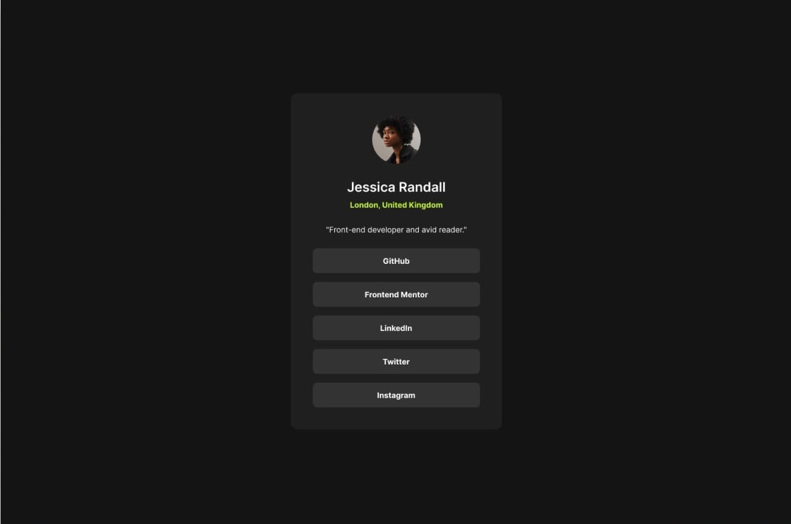

# Frontend Mentor - Social links profile solution

This is a solution to the [Social links profile challenge on Frontend Mentor](https://www.frontendmentor.io/challenges/social-links-profile-UG32l9m6dQ). Frontend Mentor challenges help you improve your coding skills by building realistic projects.

## Table of contents

- [Overview](#overview)
  - [The challenge](#the-challenge)
  - [Screenshot](#screenshot)
  - [Links](#links)
- [My process](#my-process)
  - [Built with](#built-with)
  - [What I learned](#what-i-learned)
- [Author](#author)

## Overview

### The challenge

Users should be able to:

- See hover and focus states for all interactive elements on the page

### Screenshot



### Links

- Solution URL: [https://www.frontendmentor.io/solutions/sociallinksprofile-44CgGliRIf](https://www.frontendmentor.io/solutions/sociallinksprofile-44CgGliRIf)
- Live Site URL: [https://social-links-profile-rho-ten.vercel.app/](https://social-links-profile-rho-ten.vercel.app/)

## My process

### Built with

- Semantic HTML5 markup
- CSS custom properties
- Flexbox
- CSS Grid
- Mobile-first workflow

### What I learned

```html
<h1>Some HTML code I'm proud of</h1>
```

```css
.proud-of-this-css {
  color: papayawhip;
}
```

## Author

- Website - [iamzaidmohammed](https://www.iamzaidmohammed.github.io)
- Frontend Mentor - [@iamzaidmohammed](https://www.frontendmentor.io/profile/iamzaidmohammed)
- Twitter - [@iamzaidmohammed](https://www.twitter.com/iamzaidmohammed)
